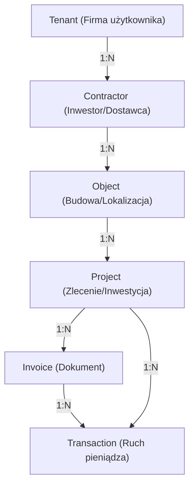

# Sig ERP – AI Master Context (AI_look.md)

Ten plik jest "DNA" technologicznym i biznesowym systemu SIG ERP. Jest przeznaczony wyłącznie dla modeli LLM, aby zapewnić 100% zrozumienia architektury, logiki finansowej i standardów kodowania bez konieczności ponownego researchu całego codebase.

---

## 🏗️ 1. Architektura Systemu (The "How")

System zbudowany w oparciu o **RSC (React Server Components)** i architekturę **Next.js 15 (App Router)**.

### Tech Stack:
- **Core**: Next.js 15.2.8, React 19, Tailwind CSS 4.
- **Persistence (Dual-Sync)**:
  - **Cloud Firestore**: Primary SSoT dla szybkości i elastyczności (NoSQL).
  - **PostgreSQL (Neon) + Prisma**: Secondary SSoT dla raportowania relacyjnego i analityki.
- **Auth**: Firebase Auth (Admin SDK na backendzie, Client SDK na frontendzie).
- **AI**: Google Gemini 2.0 Flash (OCR faktur i analiza danych).
- **Finanse**: `decimal.js` dla precyzyjnych obliczeń pieniężnych.

### 🔴 Build-Safe Firebase Admin
Inicjalizacja Admin SDK w `src/lib/firebaseAdmin.ts` jest **leniwa (lazy initialization)**. Ma to na celu zapobieganie crashom podczas buildu na Vercelu, gdy zmienne środowiskowe nie są jeszcze dostępne. Zawsze używaj getterów: `getAdminDb()`, `getAdminAuth()`, `getAdminStorage()`.

---

## 🔁 2. Mechanizm Dual-Sync (Persistence Strategy)

Zapis danych odbywa się w modelu **Firestore-First with Manual Rollback**:
1. Server Action inicjuje transakcję w Firestore (`adminDb.runTransaction`).
2. Po sukcesie w Firestore, dane są zapisywane w Prisma (PostgreSQL).
3. **Rollback**: Jeśli Prisma rzuci błąd, Server Action musi **ręcznie usunąć** rekordy z Firestore, aby zachować spójność.
4. **Health Check**: W UI znajduje się wskaźnik spójności (`getSyncStatus`), który porównuje licznik rekordów w obu bazach.

---

## 🗺️ 3. Domena i Relacje (Data Lineage)

### Kluczowe Zasady:
- **TenantId**: Każdy rekord musi posiadać `tenantId` dla izolacji danych.
- **Classification**: 
    - `PROJECT_COST`: Koszt przypisany do konkretnego ID projektu.
    - `GENERAL_COST`: Koszt ogólny (np. biuro, paliwo), nieposiadający ID projektu.
    - `INTERNAL_COST`: Koszty wewnętrzne.
- **Hierarchia**: Usunięcie Kontrahenta usuwa jego Obiekty, te usuwają Projekty itd. (Cascade).

---

## 💰 4. Logika Biznesowa i Finanse

### Modele Obliczeń (Profit First):
System implementuje strategię bezpiecznych wypłat:
1. `Safe to Spend = Bilans - VAT - CIT (9%)` (Standardowa rezerwa podatkowa).
2. `Operating Profit = Revenue Net - Costs Net`

### Standard Ledger (Append-Only):
- Wszystkie transakcje są **niezmienne (Immutable)** po wyjściu ze statusu `DRAFT`.
- **Reversal Pattern**: Błędną transakcję koryguje się poprzez stworzenie nowej o przeciwnym znaku (negacja kwoty) i powiązanie jej polem `reversalOf`.

### Contractor Search & NIP Upsert:
System posiada wbudowaną wyszukiwarkę kontrahentów (Search & Select). Implementuje **Intelligent Upsert** – przed zapisem kosztu/przychodu system sprawdza czy NIP istnieje w Firestore oraz Prisma. **Nowa zasada**: Jeśli NIP nie jest podany, system blokuje utworzenie nowej kartoteki, jeśli nazwa (case-insensitive) już istnieje, wymuszając deduplikację danych.

### Build & Synchronization
        - **Vercel Build Hook**: Proactive database sync using `npx prisma db push && npx prisma generate` in `package.json` before `next build`.
        - **Dual-Sync Guard**: Firestore acts as the primary source of truth, Prisma is synchronized during the build and runtime.

        ### UI/UX Protections
        - **Conditional Form Logic**: The "Kaucja Gwarancyjna" (Security Deposit) section is rendered only for `REVENUE` or when the category is set to `INWESTYCJA`. This prevents "UI/UX Drift" where users are presented with irrelevant fields for standard expenses.

---

## 🔍 5. OCR Inbox & Auto-Matching (Workflow)

1. **Upload**: PDF/Obraz trafia do `InvoiceScanner.tsx`. Obsługuje do 5 plików jednocześnie (Batch Mode).
2. **Scan**: Route Handler `/api/ocr/scan` przesyła każdą stronę do Gemini 3 Flash.
3. **Multi-Entity**: Gemini wykrywa wiele dokumentów na jednym obrazie i zwraca tablicę obiektów JSON.
4. **Inbox Queue**: Dokumenty trafiają do kolejki (Inbox), gdzie są automatycznie walidowane przez `/api/intake/ocr-draft`.
5. **Auto-Match ("Pewniak")**: System sprawdza historię kontrahenta przez `getAutoMatchData` i przypisuje projekt/kategorię. Pola te są oznaczone gwiazdką i kolorem zielonym.
6. **Bulk Action**: Przycisk "Zaksięguj Wszystkie Prawidłowe" wykonuje seryjne `addCostInvoice` / `addIncomeInvoice`.

---

## 🚩 6. Wytyczne dla AI (Coding Standards)

- **Zero Mutation**: Nigdy nie modyfikuj bezpośrednio obiektów systemowych (np. `File`), używaj stanów Reacta.
- **Server Action Contract**: Zawsze zwracaj `{ success: boolean, error?: string, data?: any }`.
- **Decimal Precision**: Do obliczeń finansowych używaj wyłącznie `Decimal`. Prisma przechowuje `Decimal(12,2)`.
- **Dual-Sync Guard**: Każdy CRUD zmieniający stan musi operować na obu bazach danych.

---

## 📜 7. Log błędów i Rozwiązań (Bug Log History)

| ID | Moduł | Status | Opis | Naprawa |
|:---|:---|:---|:---|:---|
| 001 | Finanse | FIXED | Błąd serializacji Decimal w RSC. | Konwersja na String/Number przed wysyłką. |
| B3 | Firebase | FIXED | Crash buildu na Vercelu (Init). | Wdrożono mechanizm `getAdminDb()` (Lazy Init). |
| Vector 007 | Project Drift | FIXED | Projekty widoczne tylko w Firestore. | Poprawiono `projects.ts`, dodano tryb Healer dla synchronizacji. |
| Vector 009 | Fetcher Error | FIXED | NoSQL limit `in` (max 30 id). | Wdrożono Chunking zapytań w `crm.ts`. |
| Vector 011 | Dashboard | FIXED | Błędna matematyka marży (Gross vs Net). | Obliczenia zysku oparte teraz wyłącznie o wartości Netto. |
| Vector 012 | RegisterIncomeModal | FIXED | Brak kategorii "INWESTYCJA". | Dodano kategorię do słowników w `lib/categories` i modalach. |
| Vector 013 | Build / Vercel | FIXED | Null constraint violation (projectId). | Wymuszono `db push` w `package.json` oraz ustawiono `projectId` jako optional (?) w Prisma Schema. |
| Vector 014 | UI/UX Drift | FIXED | Kaucja widoczna dla kosztów paliwa. | Wdrożono warunkowy rendering kaucji w modalach (tylko dla INWESTYCJA). |
| Vector 015 | Data Integrity | FIXED | Śmieciowe rekordy "Orlen" bez NIP. | Wdrożono `contractorHealer.ts` (Deduplikacja) i walidację unikalności nazw przy braku NIP-u. |
| Vector 016 | UI/UX | FIXED | Dropdowny uciekają poza modal. | Wprowadzono `max-h-60` i `overflow-y-auto` dla list Select. |
| Vector 017 | Architecture | FIXED | Drift danych Firestore vs Prisma w CRM. | Ujednolicono źródło danych na Prisma-First i dodano funkcję synchronizacji `syncAllContractorsToPrisma`. |
| Vector 018 | Logic Error | FIXED | Błędne saldo kontrahenta (Demetrix). | Wdrożono formułę `SUM(...) WHERE status NOT IN ('PAID', 'REVERSED')`, ujednolicono Tabs do `div` architecture oraz naprawiono overflow w modalach (`max-h-70vh`). |
| Vector 019 | Logic / Compliance | FIXED | CIT Rate mismatch (19% vs 9%). | Zmieniono stawkę CIT z 19% na 9% (Mały Podatnik) w dokumentacji `SYSTEM_DNA`, `FINANCE_ENGINE`, `README` oraz w etykietach Dashboardu. |
| Vector 020 | AI / Automation | FIXED | Manual data entry for invoices. | Wdrożono `scanInvoiceAction` (Gemini 3 Flash Preview) z Tarcza Anty-Duplikatowa i Smart Match NIP. |
| Vector 021 | Critical Fix | FIXED | Gemini 404 & API 500 crashes. | Zaktualizowano model do `gemini-3-flash-preview`, zunifikowano silnik w `lib/gemini.ts` i wdrożono Tarcze Anty-Crash. |
| Vector 022 | Logic / Infra | FIXED | OCR Draft 422 & Prisma Warning. | Naprawiono typ `vatRate` w Zod (coerce) i zmigrowano konfigurację Prisma z `package.json` do `prisma.config.ts`. |
| Vector 023 | Analytics / UX | FIXED | Yearly view precision & historic data. | Wdrożono dynamiczny selektor lat na Dashboardzie z filtrowaniem `startDate`/`endDate` w Server Component. |
| Vector 024 | Analytics / UX | FIXED | Dead liquidity button. | Aktywowano przycisk "Zarządzaj Kosztami" z dynamicznym filtrowaniem `status=UNPAID` i zachowaniem kontekstu roku. |
| Vector 025 | AI / Batch OCR | FIXED | Multi-document OCR & Batch Mode. | Wdrożono obsługę wielu dokumentów na jednym zdjęciu oraz seryjne przesyłanie plików (do 5). |
| Vector 026 | AI / Automation | FIXED | OCR Inbox & Auto-Matching. | Wdrożono kolejkę Inbox, logikę "Pewniak" (Smart Match historyczny) oraz Bulk Action. |
| Vector 027 | UI / UX / Data | FIXED | Brak usuwania i detali faktur. | Wdrożono Safe Delete (potwierdzenie) oraz Quick View (detale OCR) w Rejestrze Transakcji. |
| Vector 028 | AI / Logic / UX | FIXED | Brak szybkiego opłacania. | Dodano Quick Action: Opłać oraz wdrożono Zero-Day Auto-Pay dla faktur gotówkowych. |
| Vector 029 | AI / Finance / Logic | FIXED | Brak Skarbca Kaucji. | Wdrożono moduł Retention Vault z obsługą kaucji manualnych, procentowych oraz systemem alertów 30d. |
| Vector 030 | CRM / Finance / UX | FIXED | Quick Add for Contractors & Projects. | Wdrożono system szybkiej rejestracji Inwestorów i Projektów bezpośrednio w module Kaucji z obsługą Firestore/SQL Dual-Sync. |
| Vector 031 | Project Health / Logic | FIXED | Dynamic Budget Aggregation (Gross Invoices). | Przełączono moduł Analizy Zdrowia na obliczenia oparte o faktury EXPENSE (Brutto) zamiast płatności, z precyzyjnym ProgressBar i statusem limitu. |
| Vector 032 | Project Health / P&L | FIXED | Unit Profitability Scorecard (P&L). | Wdrożono widok rentowności w modalu analizy: Przychody Netto vs Koszty Netto = Marża, z automatycznym alertem dla projektów niedochodowych. |

---

> [!IMPORTANT]
> Przy każdej modyfikacji kodu, Assistent musi zweryfikować, czy zmiana zachowuje spójność między Firestore a Prisma oraz czy zachowano izolację `tenantId`.
