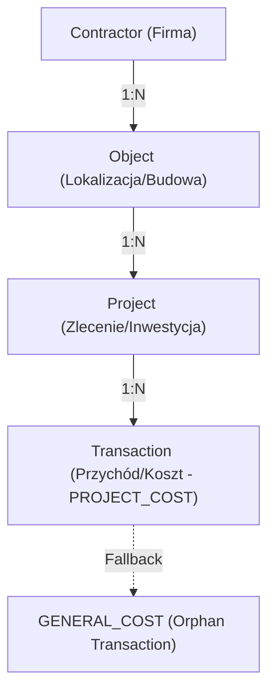

# Sig ERP – AI Master Context (AI_look.md)

Ten plik jest przeznaczony wyłącznie dla modeli LLM. Zawiera "DNA" techniczne systemu, mapy relacji i rejestr błędów, aby zapewnić 100% synchronizacji kontekstu.

---

## 🏗️ 1. Architektura Techniczna (Next.js 15)

System zbudowany w architekturze **Server Components (RSC)** z wykorzystaniem:
- **Frontend**: Next.js 15 (App Router), Tailwind CSS (Vanilla Logic).
- **Backend**: Server Actions (logic layer), Route Handlers (OCR/API).
- **Persistence (Dual-Sync)**:
  - **Cloud Firestore**: Primary SSoT dla danych operacyjnych (NoSQL, szybki odczyt, dynamiczne schematy).
  - **PostgreSQL (Neon) + Prisma**: Secondary Storage (Relacyjne raportowanie, analityka, backup).
- **Auth**: Firebase Auth (Admin SDK na backendzie, Client SDK na frontendzie).

---

## 💎 2. SSoT (Single Source of Truth) dla Transakcji

Transakcja jest atomowym rekordem pieniądza. Spójność wymuszana jest przez:
1. **Atrybut `tenantId`**: Całkowita izolacja danych między firmami.
2. **Atrybut `classification`**:
   - `PROJECT_COST`: Koszt powiązany z konkretnym ID projektu.
   - `GENERAL_COST`: Koszt administracyjny/ogólny (bez przypisanego projektu).
3. **Logika Fallback**: Każdy brak `projectId` przy koszcie -> auto-klasyfikacja jako `GENERAL_COST`.
4. **Relacja kaskadowa**: Usunięcie projektu -> kaskadowe usunięcie wszystkich jego transakcji (Firestore & Prisma).

---

## 🗺️ 3. Mapa Relacji (Data Lineage)

- **Contractor**: Centralny podmiot (Inwestor/Dostawca).
- **Object**: Fizyczna lokalizacja (miejsce powstawania kosztów).
- **Project**: Kontener logiczny (budżet, etapy).
- **Transaction**: Ruch gotówkowy.

---

## 🚩 4. Aktywne Flagi i Tryby (Feature Flags)

- `ENABLE_TEST_DELETE`: Jeśli `true`, UI wyświetla przyciski usuwania. Weryfikowane po stronie serwera przez `NEXT_PUBLIC_ENABLE_TEST_DELETE`.
- `FORCE_DYNAMIC`: System wymusza `force-dynamic` na wszystkich stronach odczytu danych, aby zapobiec starzeniu się cache'u Firestore.

---

### Monitorowanie Spójności (Health Check)
Wdrożono system "Licznika Spójności" (Dual-Sync Health Indicator) w głównym pasku nawigacyjnym. System weryfikuje w czasie rzeczywistym (co 5 minut lub przy przeładowaniu) liczbę rekordów w kluczowych kolekcjach: `Projects`, `Transactions`, `Invoices`.
- **Status 🟢**: Pełna synchronizacja 1:1 między Firestore (Operational) a Prisma (Analytical).
- **Status 🔴**: Rozbieżność danych. Wymaga interwencji i sprawdzenia logów pod kątem "Dual-Sync Drift".
- **Metoda**: Akcja serwerowa `getSyncStatus` wykonuje zapytania `.count()` na obu warstwach bazodanowych dla aktywnego `tenantId`.

### Słownik Kategorii Finansowych
Wdrożono dynamiczny system podziału kategorii kosztów oparty na relacji z projektami:
- **DIRECT (Koszty Bezpośrednie):** Dotyczą konkretnego projektu budowlanego/wykonawczego (np. Materiały, Usługi obce, Wynajem sprzętu, Paliwo Projektu).
- **INDIRECT (Koszty Pośrednie):** Koszty ogólne funkcjonowania firmy (Brak Projektu) (np. Biuro, Flota, Marketing, Księgowość/Prawne, Podatki).
Logika zawarta jest w pliku `categories.ts` i bezpośrednio kontroluje dostępne opcje w oknie dodawania kosztu.

---

## Log Błędów i Rozwiązań (Bug Log)

| ID | Moduł | Status | Opis | Naprawa |
|:---|:---|:---|:---|:---|
| 001 | Finanse | FIXED | Błąd serializacji Decimal przy przesyłaniu do RSC. | Konwersja na String/Number przed wysyłką. |
| 002 | CRM | FIXED | Contractor Data Mapping | NIP mapowany do adresu przy typie HURTOWNIA. Wdrożono heurystykę serwerową i hardening UI. |
| 003 | Projekty | FIXED | Brak punktu wejścia transakcji | Dodano przyciski "Dodaj Przychód/Koszt" bezpośrednio na kartach projektów. |
| 004 | Finanse | FIXED | Raw IDs in Modals & Auto-fill | Naprawiono mapowanie nazw w Selectach oraz wdrożono contextual auto-fill kontrahenta. |
| 003 | Projekty | FIXED | 500 error przy revalidatePath po usunięciu. | Zastosowanie Safe Redirect Pattern (redirect przed renderem). |
| B3 | Firebase | FIXED | Init Build Error | Wdrożono `getAdminDb()` (Lazy Initialization) w `@/lib/firebaseAdmin.ts`. |
| B4 | Persistence | FIXED | Dual-Sync Drift | Wszystkie akcje (CRUD) wykonują operację w Firestore, a następnie `await prisma...` dla spójności. |
| B5 | CRM | FIXED | Contractor Data Mapping | Nieprawidłowe mapowanie danych kontrahenta z formularza do bazy danych. |
| Vector 004 | Skrypt OCR | ROZWIĄZANY | `gemini` object not found w InvoiceScanner | Zamiana @google/generative-ai na lokalny /api endpoint używający OpenAI, wyczyszczenie błędnych importów i logiki frontendowej Gemini. Opracowano sztywny kontrakt `SanitizedOcrDraft`. |
| Vector 005 | Słownik Walut | WAITING | Wpisywanie ręczne kodu waluty powoduje literówki | Zamiana inputa na dropdown standardu ISO 4217, wstępna adaptacja bazy `Currency` i modalu na EUR, USD. |
| Vector 006 | Dual-Sync Drift | ROZWIĄZANY | Błąd 500 w Firestore + Prisma podczas księgowania faktur. Częściowy zapis powodował niespójności. | Oplecenie Server Actions w instrukcje `try/catch`. W przypadku błędu na poziomie `prisma.create(...)`, rekord w Firestore jest usuwany (Simulated Rollback). Wdrożono skrypt `clean_firestore.ts` i wskaźnik Health Check. |
| Vector 007 | Project Drift | ROZWIĄZANY | Health Check zgłosił błąd ilości projektów. Nowy projekt + obiekt istniał tylko w Firestore (API używało wyłącznie polecenia .add(), omijając Prisma DB). | Logika w `projects.ts` otrzymała wymuszone `.doc().id` na tworzenie oraz manualny zapis do Postgres. Do ratowania osieroconych danych post-mortem dodano tryb Healer w pliku `healer.ts`. |
| 005 | Finanse | FIXED | Błąd 500 (Server Action) przy addTransaction / render charts. | Wdrożono safe error handling w Server Actions `{error: string}`. Wymuszono `minWidth={0} minHeight={0}` oraz wstrzymano render po stronie serwera (`isMounted`) w Recharts. |
| 006 | Finanse | FIXED | Utrata spójności (Dual-Sync Drift) podczas zapisu faktur. | Wprowadzono blok `try/catch` otaczający zapis Prisma. W razie wystąpienia błędu system symuluje Rollback, usuwając zapisane rekordy z chmury Firebase (invoices, transactions). |

---

> [!IMPORTANT]
> Przy każdej modyfikacji kodu, Assistent musi zweryfikować, czy zmiana nie narusza Mapy Relacji (Punkt 3) oraz czy typowanie `classification` transakcji jest zachowane.
