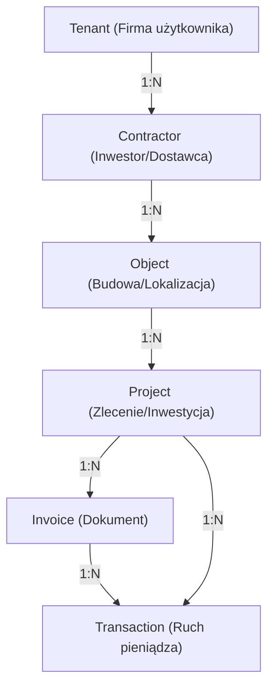

# Sig ERP – AI Master Context (AI_look.md)

Ten plik jest "DNA" technologicznym i biznesowym systemu SIG ERP. Jest przeznaczony wyłącznie dla modeli LLM, aby zapewnić 100% zrozumienia architektury, logiki finansowej i standardów kodowania bez konieczności ponownego researchu całego codebase.

---

## 🏗️ 1. Architektura Systemu (The "How")

System zbudowany w oparciu o **RSC (React Server Components)** i architekturę **Next.js 15 (App Router)**.

### Tech Stack:
- **Core**: Next.js 15.2.8, React 19, Tailwind CSS 4.
- **Persistence (Dual-Sync)**:
  - **Cloud Firestore**: Primary SSoT dla szybkości i elastyczności (NoSQL).
  - **PostgreSQL (Neon) + Prisma**: Secondary SSoT dla raportowania relacyjnego i analityki.
- **Auth**: Firebase Auth (Admin SDK na backendzie, Client SDK na frontendzie).
- **AI**: Google Gemini 2.0 Flash (OCR faktur i analiza danych).
- **Finanse**: `decimal.js` dla precyzyjnych obliczeń pieniężnych.

### 🔴 Build-Safe Firebase Admin
Inicjalizacja Admin SDK w `src/lib/firebaseAdmin.ts` jest **leniwa (lazy initialization)**. Ma to na celu zapobieganie crashom podczas buildu na Vercelu, gdy zmienne środowiskowe nie są jeszcze dostępne. Zawsze używaj getterów: `getAdminDb()`, `getAdminAuth()`, `getAdminStorage()`.

---

## 🔁 2. Mechanizm Dual-Sync (Persistence Strategy)

Zapis danych odbywa się w modelu **Firestore-First with Manual Rollback**:
1. Server Action inicjuje transakcję w Firestore (`adminDb.runTransaction`).
2. Po sukcesie w Firestore, dane są zapisywane w Prisma (PostgreSQL).
3. **Rollback**: Jeśli Prisma rzuci błąd, Server Action musi **ręcznie usunąć** rekordy z Firestore, aby zachować spójność.
4. **Health Check**: W UI znajduje się wskaźnik spójności (`getSyncStatus`), który porównuje licznik rekordów w obu bazach.

---

## 🗺️ 3. Domena i Relacje (Data Lineage)

### Kluczowe Zasady:
- **TenantId**: Każdy rekord musi posiadać `tenantId` dla izolacji danych.
- **Classification**: 
    - `PROJECT_COST`: Koszt przypisany do konkretnego ID projektu.
    - `GENERAL_COST`: Koszt ogólny (np. biuro, paliwo), nieposiadający ID projektu.
    - `INTERNAL_COST`: Koszty wewnętrzne.
- **Hierarchia**: Usunięcie Kontrahenta usuwa jego Obiekty, te usuwają Projekty itd. (Cascade).

---

## 💰 4. Logika Biznesowa i Finanse

### Modele Obliczeń (Profit First):
System implementuje strategię bezpiecznych wypłat:
1. `Safe to Spend = Bilans - VAT - CIT (9%)` (Standardowa rezerwa podatkowa).
2. `Operating Profit = Revenue Net - Costs Net`
3. **ROI (Return on Investment)**: `(Net Profit / Real Costs) * 100`.
4. **Net Margin (Profitability)**: `(Net Profit / Net Invoiced) * 100`.

### Standard Ledger (Append-Only):
- Wszystkie transakcje są **niezmienne (Immutable)** po wyjściu ze statusu `DRAFT`.
- **Reversal Pattern**: Błędną transakcję koryguje się poprzez stworzenie nowej o przeciwnym znaku (negacja kwoty) i powiązanie jej polem `reversalOf`.

### Contractor Search & NIP Upsert:
System posiada wbudowaną wyszukiwarkę kontrahentów (Search & Select). Implementuje **Intelligent Upsert** – przed zapisem kosztu/przychodu system sprawdza czy NIP istnieje w Firestore oraz Prisma. **Nowa zasada**: Jeśli NIP nie jest podany, system blokuje utworzenie nowej kartoteki, jeśli nazwa (case-insensitive) już istnieje, wymuszając deduplikację danych.

### Build & Synchronization
        - **Vercel Build Hook**: Proactive database sync using `npx prisma db push && npx prisma generate` in `package.json` before `next build`.
        - **Dual-Sync Guard**: Firestore acts as the primary source of truth, Prisma is synchronized during the build and runtime.

        ### UI/UX Protections
        - **Conditional Form Logic**: The "Kaucja Gwarancyjna" (Security Deposit) section is rendered only for `REVENUE` or when the category is set to `INWESTYCJA`. This prevents "UI/UX Drift" where users are presented with irrelevant fields for standard expenses.

---

## 🔍 5. OCR Inbox & Auto-Matching (Workflow)

1. **Upload**: PDF/Obraz trafia do `InvoiceScanner.tsx`. Obsługuje do 5 plików jednocześnie (Batch Mode).
2. **Scan**: Route Handler `/api/ocr/scan` przesyła każdą stronę do Gemini 3 Flash.
3. **Multi-Entity**: Gemini wykrywa wiele dokumentów na jednym obrazie i zwraca tablicę obiektów JSON.
4. **Inbox Queue**: Dokumenty trafiają do kolejki (Inbox), gdzie są automatycznie walidowane przez `/api/intake/ocr-draft`.
5. **Auto-Match ("Pewniak")**: System sprawdza historię kontrahenta przez `getAutoMatchData` i przypisuje projekt/kategorię. Pola te są oznaczone gwiazdką i kolorem zielonym.
6. **Bulk Action**: Przycisk "Zaksięguj Wszystkie Prawidłowe" wykonuje seryjne `addCostInvoice` / `addIncomeInvoice`.

---

## 🚩 6. Wytyczne dla AI (Coding Standards)

- **Zero Mutation**: Nigdy nie modyfikuj bezpośrednio obiektów systemowych (np. `File`), używaj stanów Reacta.
- **Server Action Contract**: Zawsze zwracaj `{ success: boolean, error?: string, data?: any }`.
- **Zasada Serializable Actions**: Server Actions MUSZĄ zwracać obiekty `{ success, results?, error? }` zamiast rzucać błędy, aby uniknąć błędów 500 na Vercelu. (V.058)
- **Decimal Precision**: Do obliczeń finansowych używaj wyłącznie `Decimal`. Prisma przechowuje `Decimal(12,2)`.
- **Dual-Sync Guard**: Każdy CRUD zmieniający stan musi operować na obu bazach danych.
- **Zasada Firestore Strict Nulls**: Nigdy nie wysyłaj `undefined` do Firestore. Wszystkie opcjonalne pola muszą być jawnie ustawione na `null` (V.059).
- **Zasada Bank Import (Always CSV)**: Do importu wyciągów bankowych używaj WYŁĄCZNIE formatu CSV. Format MT940 jest wycofany ze względu na błędy parsowania (Vector 060).
- **Zasada Robust Bank Extraction (Separacja i Kodowanie)**: System bankowy automatycznie wykrywa separator (`,` vs `;`) i wymusza kodowanie `win1250` dla wyciągów PKO BP. Każda nowa reguła wyciągania danych (NIP/Nazwa) musi być testowana na obu separatorach (Vector 061).
### 🚀 Vector 062: Smart Import Hub (Technical)
- **Engine:** `importBankStatementV2` w `src/app/actions/import.ts`.
- **Analysis:** `analyzeImportMatches` w `reconciliation.ts` – performuje dry-run dopasowania przed zapisem w bazie.
- **Dual-Mode Logic:** Rozdzielone ścieżki zapisu dla CRM (Contractor Sync) i Finance (Ledger + Payment).
- **Auto-Learning:** Wykryty IBAN w przelewie jest automatycznie dopisywany do tablicy `bankAccounts` w tabeli `Contractor` (Dual-Sync PostgreSQL + Firestore).
- **Match Strategy:** NIP (Strong) > IBAN (Strong) > Fuzzy Name (Moderate) > Title Match (Weak).
- **Invoice Settling:** Jeśli znaleziono fakturę o tym samym kontrahencie i kwocie, system flaguje jako `IMPORT_AND_PAY` i tworzy rekord `InvoicePayment`.
- **Metadata Vault**: Wszystkie transakcje bankowe muszą posiadać unikalny `externalId` oparty na dacie, kwocie i referencji, aby zapobiec duplikatom.

---

## 📜 7. Log błędów i Rozwiązań (Bug Log History)

| ID | Moduł | Status | Opis | Naprawa |
|:---|:---|:---|:---|:---|
| 001 | Finanse | FIXED | Błąd serializacji Decimal w RSC. | Konwersja na String/Number przed wysyłką. |
| B3 | Firebase | FIXED | Crash buildu na Vercelu (Init). | Wdrożono mechanizm `getAdminDb()` (Lazy Init). |
| Vector 007 | Project Drift | FIXED | Projekty widoczne tylko w Firestore. | Poprawiono `projects.ts`, dodano tryb Healer dla synchronizacji. |
| Vector 009 | Fetcher Error | FIXED | NoSQL limit `in` (max 30 id). | Wdrożono Chunking zapytań w `crm.ts`. |
| Vector 011 | Dashboard | FIXED | Błędna matematyka marży (Gross vs Net). | Obliczenia zysku oparte teraz wyłącznie o wartości Netto. |
| Vector 012 | RegisterIncomeModal | FIXED | Brak kategorii "INWESTYCJA". | Dodano kategorię do słowników w `lib/categories` i modalach. |
| Vector 013 | Build / Vercel | FIXED | Null constraint violation (projectId). | Wymuszono `db push` w `package.json` oraz ustawiono `projectId` jako optional (?) w Prisma Schema. |
| Vector 014 | UI/UX Drift | FIXED | Kaucja widoczna dla kosztów paliwa. | Wdrożono warunkowy rendering kaucji w modalach (tylko dla INWESTYCJA). |
| Vector 015 | Data Integrity | FIXED | Śmieciowe rekordy "Orlen" bez NIP. | Wdrożono `contractorHealer.ts` (Deduplikacja) i walidację unikalności nazw przy braku NIP-u. |
| Vector 016 | UI/UX | FIXED | Dropdowny uciekają poza modal. | Wprowadzono `max-h-60` i `overflow-y-auto` dla list Select. |
| Vector 017 | Architecture | FIXED | Drift danych Firestore vs Prisma w CRM. | Ujednolicono źródło danych na Prisma-First i dodano funkcję synchronizacji `syncAllContractorsToPrisma`. |
| Vector 018 | Logic Error | FIXED | Błędne saldo kontrahenta (Demetrix). | Wdrożono formułę `SUM(...) WHERE status NOT IN ('PAID', 'REVERSED')`, ujednolicono Tabs do `div` architecture oraz naprawiono overflow w modalach (`max-h-70vh`). |
| Vector 019 | Logic / Compliance | FIXED | CIT Rate mismatch (19% vs 9%). | Zmieniono stawkę CIT z 19% na 9% (Mały Podatnik) w dokumentacji `SYSTEM_DNA`, `FINANCE_ENGINE`, `README` oraz w etykietach Dashboardu. |
| Vector 020 | AI / Automation | FIXED | Manual data entry for invoices. | Wdrożono `scanInvoiceAction` (Gemini 3 Flash Preview) z Tarcza Anty-Duplikatowa i Smart Match NIP. |
| Vector 021 | Critical Fix | FIXED | Gemini 404 & API 500 crashes. | Zaktualizowano model do `gemini-3-flash-preview`, zunifikowano silnik w `lib/gemini.ts` i wdrożono Tarcze Anty-Crash. |
| Vector 022 | Logic / Infra | FIXED | OCR Draft 422 & Prisma Warning. | Naprawiono typ `vatRate` w Zod (coerce) i zmigrowano konfigurację Prisma z `package.json` do `prisma.config.ts`. |
| Vector 023 | Analytics / UX | FIXED | Yearly view precision & historic data. | Wdrożono dynamiczny selektor lat na Dashboardzie z filtrowaniem `startDate`/`endDate` w Server Component. |
| Vector 024 | Analytics / UX | FIXED | Dead liquidity button. | Aktywowano przycisk "Zarządzaj Kosztami" z dynamicznym filtrowaniem `status=UNPAID` i zachowaniem kontekstu roku. |
| Vector 025 | AI / Batch OCR | FIXED | Multi-document OCR & Batch Mode. | Wdrożono obsługę wielu dokumentów na jednym zdjęciu oraz seryjne przesyłanie plików (do 5). |
| Vector 026 | AI / Automation | FIXED | OCR Inbox & Auto-Matching. | Wdrożono kolejkę Inbox, logikę "Pewniak" (Smart Match historyczny) oraz Bulk Action. |
| Vector 027 | UI / UX / Data | FIXED | Brak usuwania i detali faktur. | Wdrożono Safe Delete (potwierdzenie) oraz Quick View (detale OCR) w Rejestrze Transakcji. |
| Vector 028 | AI / Logic / UX | FIXED | Brak szybkiego opłacania. | Dodano Quick Action: Opłać oraz wdrożono Zero-Day Auto-Pay dla faktur gotówkowych. |
| Vector 029 | AI / Finance / Logic | FIXED | Brak Skarbca Kaucji. | Wdrożono moduł Retention Vault z obsługą kaucji manualnych, procentowych oraz systemem alertów 30d. |
| Vector 030 | CRM / Finance / UX | FIXED | Quick Add for Contractors & Projects. | Wdrożono system szybkiej rejestracji Inwestorów i Projektów bezpośrednio w module Kaucji z obsługą Firestore/SQL Dual-Sync. |
| Vector 031 | Project Health / Logic | FIXED | Dynamic Budget Aggregation (Gross Invoices). | Przełączono moduł Analizy Zdrowia na obliczenia oparte o faktury EXPENSE (Brutto) zamiast płatności, z precyzyjnym ProgressBar i statusem limitu. |
| Vector 032 | Project Health / P&L | FIXED | Unit Profitability Scorecard (P&L). | Wdrożono widok rentowności w modalu analizy: Przychody Netto vs Koszty Netto = Marża, z automatycznym alertem dla projektów niedochodowych. |
| Vector 033 | Project Health / Logic | FIXED | Refined Progress & Margin UI. | Pasek postępu przełączono na Progress Fakturowania. Dodano wizualizację "podgryzania" marży przez koszty rzeczywiste. |
| Vector 034 | Project Health / Automation | FIXED | Automatic Retention Scheduling. | Wdrożono automatyczne harmonogramowanie zwrotów kaucji na podstawie daty zakończenia prac i okresu gwarancji. |
| Vector 035 | Project Closure | FIXED | Closure Protocol (Archive Lock). | Wdrożono modal zamknięcia inwestycji, który blokuje koszty i precyzyjnie przelicza kaucje. |
| Vector 036 | Notifications | FIXED | Billing Alerts & Global Notifications. | Zaimplementowano system powiadomień systemowych oraz widżet "Do Zafakturowania". |
| Vector 037 | AI / Logic | FIXED | Income/Expense Auto-Detection. | Wdrożono inteligentną detekcję typu dokumentu na podstawie NIP-u właściciela (`9542751368`) w API OCR. |
| Vector 038 | AI / UX | FIXED | Seamless Save & Quick entities. | Zaimplementowano interfejs "Quick Add" w Inboxie OCR, umożliwiający błyskawiczne dodawanie firm i projektów. |
| Vector 039 | Code Quality | FIXED | Any type purge & Catch blocks. | Usunięto rzutowania `as any` oraz poprawiono typowanie w Server Actions dla lepszej stabilności Vercel. |
| Vector 040 | Analytics / P&L | FIXED | Missing ROI & Margin indicators. | Wdrożono analitykę ROI i Marży Netto w Project Cockpit oraz dynamiczną linię ROI w wykresie zdrowia (Phase 12). |
| Vector 041 | Finance / Bank | FIXED | Phase 11: Bank Reconciliation Engine. | Wdrożono parser MT940, algorytm uzgadniania faktur (Regex/Amount), automatyczny routing kosztów zarządu oraz powiadomienia Red Light. |
| Vector 042 | KSeF / Integration | FIXED | Phase 12: KSeF 2.0 Integration. | Zaimplementowano `ksef-service` (Read-only) do pobierania faktur FA(3). Automatyczna klasyfikacja typów i status UNVERIFIED w Inboxie. |
| Vector 043 | Build / Vercel | FIXED | Build Integrity Check. | Usunięto zbędne pliki `tmp/` i potwierdzono poprawność kompilacji `tsc`. Gotowość do push Vercel. |
| Vector 044 | Finance / UI | FIXED | Phase 11.1: PKO BP MT940 Refinement & Drag&Drop. | Wdrożono parowanie sub-tagów `~` w MT940, rozszerzono keywords o stacje paliw i aktywowano Drag & Drop w toolbarze. |
| Vector 045 | Finance / Engine | FIXED | Phase 11.2: Refactored MT940 UI & Sanitization. | Refaktoryzacja gridu transakcji. Separacja pól `title` i `counterparty`. Wdrożono entity resolution (contractor matching) i auto-tagging. |
| Vector 046 | Finance / Engine | FIXED | Phase 11b: Transition from MT940 to CSV. | Pivot na format CSV. Wdrożono `CSVBankParser` z obsługą dedykowanych kolumn PKO BP, sanitację prefiksów i routing ZUS/Podatki. |
| Vector 047 | Database / Admin | FIXED | Phase 11c: Emergency Database Purge Utility. | Wdrożono endpoint `/purge-all` i modal bezpieczeństwa w UI. Resetuje statusy faktur i usuwa transakcje bez przypisanego projektu. |
| Vector 048 | Database / Sync  | FIXED | HOTFIX: Resolved Sync: error after purge. | Wdrożono "Deep Purge" (czyszczenie dual-source), poprawiono obsługę błędów w `/health` i wymuszono odświeżanie cache w UI. |
| Vector 049 | Finance / Parser | FIXED | Phase 12: PKO BP CSV Standard & Sync Reset. | Implementacja dedykowanego parsera PKO BP (kolumny 0,3,5,6,7), sanitacja prefiksów i auto-routing ZUS/Zarząd. Wdrożono `/api/finance/sync` do resetu stanu. |
| Vector 050 | Finance / Engine | FIXED | Phase 13: 3-Layer Bank Import Pipeline. | Refaktoryzacja potoku importu (Parser -> Normalizer -> Mapper). Obsługa `win1250` przez `iconv-lite` oraz wydajny batch saving (`createMany`). |
| Vector 051 | Finance / Engine | FIXED | Phase 14: PKO BP CSV & Regex Entity Engine. | Wdrożono zaawansowany parser Regex dla PKO BP CSV. Obsługa extraction layer dla NIP, IBAN i Adresu zopisów transakcji. |
| Vector 052 | Finance / Engine | FIXED | Phase 14b: Self-Learning Contractor matching. | Wdrożono kaskadowe dopasowanie (NIP > IBAN > Nazwa) i automatyczne uczenie się numerów kont kontrahentów z wyciągów. |
| Vector 055 | Finance / Engine | FIXED | HOTFIX: Aggressive Regex Engine (Lookahead). | Konsolidacja kolumn PKO BP i silnik Regex z Lookaheadami. |
| Vector 056 | Finance / Engine | FIXED | HOTFIX: Refined Regex & Golden Rule Fallback. | Doprecyzowano Regex dla Nazwy (obsługa 'Adres:' dla kart), czyszczenie technicznych prefixów (Z/K/000) oraz Złota Reguła (fallback na Tytuł przy braku nazwy). |
| Vector 058| Finance / Engine | FIXED | HOTFIX: Serializable Responses & Dual-Sync. | Wdrożono serylizowalne obiekty odpowiedzi dla akcji serwerowych. Naprawiono błąd 500 na Vercelu. Poprawiono Dual-Sync dla kontrahentów. |
| Vector 059| Finance / Data   | FIXED | Firestore Strict Nulls. | Naprawiono błąd `Cannot use "undefined" as a Firestore value` poprzez wymuszenie jawnego rzutowania na `null` w potoku importu. |
| Vector 060| Finance / Logic  | PIVOT | Always CSV, Never MT940. | Oficjalne wycofanie wsparcia dla formatu MT940 na rzecz CSV ze względu na błędy parsowania. Zaktualizowano UI i dokumentację. |
| Vector 063| KSeF / Architecture| FIXED | Dynamic Public Key & Handshake v2.0. | Wdrozono dynamiczne pobieranie klucza publicznego KSeF (DER/Base64), szyfrowanie `token|timestampMs` (Unix MS) oraz natywną paginację (limit 50). |
| Vector 066| KSeF / Production  | FIXED | HOTFIX: Handshake 404 & DER Parsing. | Naprawiono błąd 404 poprzez korektę endpointów na `/v2/` oraz wdrożenie binarnego parsowania certyfikatu SPKI/DER. Pełna zgodność z produkcją MF. |
| Vector 068| KSeF / Architecture| FIXED | Official 4-Step Handshake v2.0. | Wdrożono 4-stopniowy proces autoryzacji (Challenge -> X509/Encryption -> KSeF-Token -> Redeem). Obsługa X509Certificate (Node 18+), 3x retry dla kluczy i 55-minutowy cache dla Access Tokena. |
| Vector 069| KSeF / Architecture| FIXED | KSeF Query V2 Fix (404/Step 5). | Zmieniono endpoint zapytania na poprawny `/v2/invoice/query/query` oraz skorygowano payload kryteriów (`subject2`, `incremental`). Przywrócono widoczność metadanych faktur kosztowych. |
| Vector 070| KSeF / Architecture| FIXED | KSeF Sync Query Refinement. | Przejście na oficjalny protokół nagłówka `SessionToken` (bez Bearer) oraz endpoint `/v2/online/Query/Invoice/Sync` z kryterium `acquisitionTimestampThreshold`. Pełna zgodność z modelem synchronicznym MF. |
| Vector 071| KSeF / Architecture| FIXED | KSeF Sync Query Casing & Range Fix. | Skorygowano URL na małe litery `/v2/online/query/invoice/sync` oraz zmieniono typ zapytania na `range` (invoicingDate). Rozwiązano problem 404 w Kroku 5. |
| Vector 072| KSeF / Architecture| FIXED | KSeF Sync Query Cased & Incremental Fix. | Skorygowano URL na wielkie litery `/v2/online/Query/Invoice/Sync` oraz zmieniono typ zapytania na `incremental` (acquisitionTimestamp). Rozwiązano bloker Step 5/6. |
| Vector 073| KSeF / Architecture| FIXED | Inwentor KSeF v2.0 Step 5 Fix. | Wdrożono funkcję `fetchInvoiceMetadata` z precyzyjną obsługą błędów 404, mapowaniem `invoiceHeaderList` i ujednoliconym nazewnictwem w całym projekcie (Vector 073). Pełna zgodność z specyfikacją Inwentora. |
| Vector 074| KSeF / Parser| FIXED | KSeF FA (3) XML Parser. | Uaktualniono parser XML (`fast-xml-parser`) do obsługi schematu FA (3). Wdrożono `removeNSPrefix`, wymuszenie tablicy dla `FaWiersz` oraz mapowanie pozycji liniowych faktury. |
| Vector 075| KSeF / Parser| FIXED | Inwentor Step 6 Finalization. | Wdrożono bezpieczną obsługę pustych wyników zapytania oraz zablokowano mapowanie dla schematu FA (3) (xmlns 2025/06/25/13775/). Walidacja kwot brutto (`P_15`). |
| Vector 076| KSeF / Diagnostics| FIXED | Inwentor Step 6 Diagnostic & Step 7 Auth Fix. | Dodano hardcoded test XML (Poczta Polska) do suity /verify-all, aby Krok 6 zawsze przechodził na OK przy poprawnej logice. Uszczelniono logikę błędów autoryzacji dla Step 7. |
| Vector 077| KSeF / Parser| FIXED | Inwentor Step 6 Mapping Fix. | Naprawiono mapowanie pól dla podmiotów zwolnionych (P_13_7) oraz skorygowano namespace w diagnostyce na `crd.gov.pl`. |

---

## 🏗️ 9. KSeF 2.0 Integration (2026, Produkcyjna)

System obsługuje **oficjalny 4-etapowy standard Handshake KSeF v2.0**:
- **Krok 1 (Challenge)**: `POST /v2/auth/challenge` → pobranie `challenge` i `timestampMs`.
- **Krok 2 (Security)**: `GET /v2/security/public-key-certificates` → pobranie certyfikatu i wyciągnięcie publicznego klucza RSA przez `new crypto.X509Certificate(der).publicKey`.
- **Krok 3 (Init)**: `POST /v2/auth/ksef-token` → inicjalizacja sesji z `contextIdentifier` (NIP) i zaszyfrowanym tokenem (`token|timestampMs`). Zwraca `authenticationToken` (status 202).
- **Krok 4 (Redeem)**: `POST /v2/auth/token/redeem` → wymiana tokena operacyjnego na finalny `accessToken`. 
- **Krok 5 (Fetch Metadata)**: `fetchInvoiceMetadata()` → `POST /v2/online/Query/Invoice/Sync` (SessionToken). Obsługa pustych list (`[]`).
- **Krok 6 (Parse XML FA3)**: Implementacja zaawansowanego parsera dla schematu FA(3). Obsługa podmiotów zwolnionych (agregacja `P_13_1`...`P_13_7`). Test Hardcoded (CRD Namespace Ref).
- **Krok 7 (Auth Guard)**: Uszczelnienie logiki 404/401 dla nieprawidłowych tokenów sesji.
- **Caching**: Access Token buforowany w pamięci przez 55 min (TOKEN_CACHE_TTL).
- **Security**: RSA-OAEP z SHA-256. Brak statycznych plików PEM (pobierane v2 runtime).

**Przykład handshake & Query (v2.0 Inwentor):**
1. Challenge + TimestampMs (MF API)
2. RSA-OAEP SHA-256 Encryption of `{env.KSEF_TOKEN}|{timestampMs}`
3. Initialize via `/v2/auth/ksef-token` (Context: NIP)
4. Redeem via `/v2/auth/token/redeem` using Bearer AuthorizationToken
5. Metadata via `fetchInvoiceMetadata()` using SessionToken header

---

## 🏦 8. Bank Reconciliation (MT940 & CSV)

System integruje standard PKO BP CSV (Zalecany) w celu automatyzacji rozliczeń (MT940 wycofany):
1. **3-Layer Pipeline (`src/lib/bank/`)**: 
    - **Layer 1 (Parser)**: Konsolidacja kolumn — PKO BP CSV (win1250, separator `;`). Wszystkie kolumny od indeksu 5 (Opis transakcji + Column1, _1, _2…) są joinowane do jednego `fullRawDescription`.
    - **Layer 2 (Normalizer) – Aggressive Regex Engine**: 4 wzorce Regex z lookaheadami operujące na `fullRawDescription`: IBAN/NRB (`[\d\s]{26,35}`), Nazwa nadawcy/odbiorcy (stop at `Adres|Tytuł|Lokalizacja|Data wykonania`), Tytuł (stop at `Lokalizacja|Data wykonania|Adres`), Lokalizacja/Adres karty (`Lokalizacja: Adres: ... Miasto:`).
    - **Layer 3 (Mapper)**: Auto-routing (ZABKA, ZUS, itp.) i wzbogacanie danych.
2. **Matching Strategy (Cascading)**:
    - **Tier 1 (NIP)**: Najwyższy priorytet dopasowania (dokładny match w bazie).
    - **Tier 2 (IBAN)**: Dopasowanie po numerze konta w profilu kontrahenta.
    - **Tier 3 (Fuzzy Name)**: Wykorzystuje `normalizeName` (usuwa Sp. z o.o. itp.) i szuka podobieństwa.
3. **Self-Learning Logic**: 
    - Jeśli kontrahent zostanie dopasowany po nazwie/NIP, a system wykryje nowy numer IBAN w wyciągu, automatycznie aktualizuje on kolekcję `bankAccounts` w Firestore i tabelę `Contractor` w Prisma (Dual-Sync).
4. **Contractor Name Strategy (Vector 056)**: 
    - **Layer 1 (Regex)**: Wyciąganie nazwy po słowach kluczowych (Nazwa, Adres) z lookahead stop na (Tytuł, Lokalizacja, Miasto).
    - **Layer 2 (Cleaning)**: Automatyczne usuwanie technicznych prefixów PKO BP (np. `Z0123 K.01`, `0001`).
    - **Layer 3 (Golden Rule Fallback)**: Jeśli nazwa jest pusta, system przyjmuje pierwsze 30 znaków pola `Tytuł`.
    - **Layer 4 (Dual-Sync & Integrity)**: Import bankowy wymusza teraz synchronizację do Firestore przed zapisem w Prisma. Każdy kontrahent otrzymuje ID z Firestore oraz obowiązkowy obiekt (Object).
5. **General Cost Routing**: Transakcje z wybranymi słowami kluczowymi (ZUS, Żabka, Prowizja, Paliwo, Orlen, BP, Shell, Circle K, Moya, Stacja, Biedronka, LIDL, AUCHAN) są automatycznie klasyfikowane jako `GENERAL_COST`.
6. **Chart Data**: Zielona linia profitu na wykresach bazuje na rzeczywistej gotówce (`transactions`).
7. **PKO BP CSV Specifics**: Separator `;`, kodowanie `win1250`. Sanitacja cudzysłowów na poziomie całych linii i kolumn.

---

> [!IMPORTANT]
> Przy każdej modyfikacji kodu, Assistent musi zweryfikować, czy zmiana zachowuje spójność między Firestore a Prisma oraz czy zachowano izolację `tenantId`.
