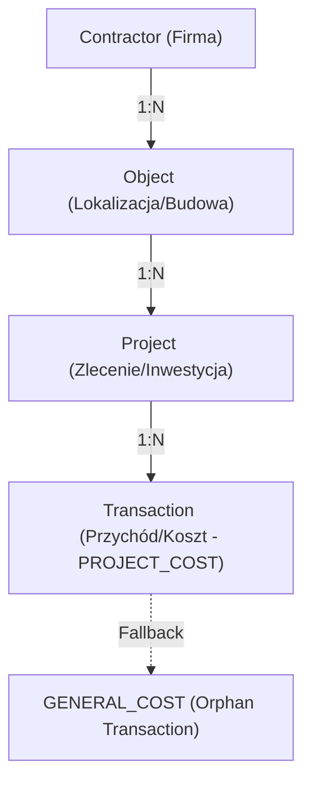

# Sig ERP – AI Master Context (AI_look.md)

Ten plik jest przeznaczony wyłącznie dla modeli LLM. Zawiera "DNA" techniczne systemu, mapy relacji i rejestr błędów, aby zapewnić 100% synchronizacji kontekstu.

---

## 🏗️ 1. Architektura Techniczna (Next.js 15)

System zbudowany w architekturze **Server Components (RSC)** z wykorzystaniem:
- **Frontend**: Next.js 15 (App Router), Tailwind CSS (Vanilla Logic).
- **Backend**: Server Actions (logic layer), Route Handlers (OCR/API).
- **Persistence (Dual-Sync)**:
  - **Cloud Firestore**: Primary SSoT dla danych operacyjnych (NoSQL, szybki odczyt, dynamiczne schematy).
  - **PostgreSQL (Neon) + Prisma**: Secondary Storage (Relacyjne raportowanie, analityka, backup).
- **Auth**: Firebase Auth (Admin SDK na backendzie, Client SDK na frontendzie).

---

## 💎 2. SSoT (Single Source of Truth) dla Transakcji

Transakcja jest atomowym rekordem pieniądza. Spójność wymuszana jest przez:
1. **Atrybut `tenantId`**: Całkowita izolacja danych między firmami.
2. **Atrybut `classification`**:
   - `PROJECT_COST`: Koszt powiązany z konkretnym ID projektu.
   - `GENERAL_COST`: Koszt administracyjny/ogólny (bez przypisanego projektu).
3. **Logika Fallback**: Każdy brak `projectId` przy koszcie -> auto-klasyfikacja jako `GENERAL_COST`.
4. **Relacja kaskadowa**: Usunięcie projektu -> kaskadowe usunięcie wszystkich jego transakcji (Firestore & Prisma).

---

## 🗺️ 3. Mapa Relacji (Data Lineage)

- **Contractor**: Centralny podmiot (Inwestor/Dostawca).
- **Object**: Fizyczna lokalizacja (miejsce powstawania kosztów).
- **Project**: Kontener logiczny (budżet, etapy).
- **Transaction**: Ruch gotówkowy.

---

## 🚩 4. Aktywne Flagi i Tryby (Feature Flags)

- `ENABLE_TEST_DELETE`: Jeśli `true`, UI wyświetla przyciski usuwania. Weryfikowane po stronie serwera przez `NEXT_PUBLIC_ENABLE_TEST_DELETE`.
- `FORCE_DYNAMIC`: System wymusza `force-dynamic` na wszystkich stronach odczytu danych, aby zapobiec starzeniu się cache'u Firestore.

---

## 🐛 5. Rejestr "Wektorów Błędów" (Bug Log)

| ID | Problem | Rozwiązanie (Status: FIXED) |
|---|---|---|
| B1 | RSC Crash przy usuwaniu projektu | Dodano `redirect` po stronie serwera zamiast odświeżania po stronie klienta. |
| B2 | Ghost Transactions | Zaimplementowano kaskadowy purge w `deleteProject`. |
| B3 | Firebase Init Build Error | Wdrożono `getAdminDb()` (Lazy Initialization) w `@/lib/firebaseAdmin.ts`. |
| B4 | Dual-Sync Drift | Wszystkie akcje (CRUD) wykonują operację w Firestore, a następnie `await prisma...` dla spójności. |

---

> [!IMPORTANT]
> Przy każdej modyfikacji kodu, Assistent musi zweryfikować, czy zmiana nie narusza Mapy Relacji (Punkt 3) oraz czy typowanie `classification` transakcji jest zachowane.
