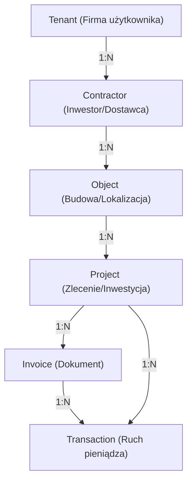

# Sig ERP – AI Master Context (AI_look.md)

Ten plik jest "DNA" technologicznym i biznesowym systemu SIG ERP. Jest przeznaczony wyłącznie dla modeli LLM, aby zapewnić 100% zrozumienia architektury, logiki finansowej i standardów kodowania bez konieczności ponownego researchu całego codebase.

---

## 🏗️ 1. Architektura Systemu (The "How")

System zbudowany w oparciu o **RSC (React Server Components)** i architekturę **Next.js 15 (App Router)**.

### Tech Stack:
- **Core**: Next.js 15.2.8, React 19, Tailwind CSS 4.
- **Persistence (Dual-Sync)**:
  - **Cloud Firestore**: Primary SSoT dla szybkości i elastyczności (NoSQL).
  - **PostgreSQL (Neon) + Prisma**: Secondary SSoT dla raportowania relacyjnego i analityki.
- **Auth**: Firebase Auth (Admin SDK na backendzie, Client SDK na frontendzie).
- **AI**: Google Gemini 2.0 Flash (OCR faktur i analiza danych).
- **Finanse**: `decimal.js` dla precyzyjnych obliczeń pieniężnych.

### 🔴 Build-Safe Firebase Admin
Inicjalizacja Admin SDK w `src/lib/firebaseAdmin.ts` jest **leniwa (lazy initialization)**. Ma to na celu zapobieganie crashom podczas buildu na Vercelu, gdy zmienne środowiskowe nie są jeszcze dostępne. Zawsze używaj getterów: `getAdminDb()`, `getAdminAuth()`, `getAdminStorage()`.

---

## 🔁 2. Mechanizm Dual-Sync (Persistence Strategy)

Zapis danych odbywa się w modelu **Firestore-First with Manual Rollback**:
1. Server Action inicjuje transakcję w Firestore (`adminDb.runTransaction`).
2. Po sukcesie w Firestore, dane są zapisywane w Prisma (PostgreSQL).
3. **Rollback**: Jeśli Prisma rzuci błąd, Server Action musi **ręcznie usunąć** rekordy z Firestore, aby zachować spójność.
4. **Health Check**: W UI znajduje się wskaźnik spójności (`getSyncStatus`), który porównuje licznik rekordów w obu bazach.

---

## 🗺️ 3. Domena i Relacje (Data Lineage)

### Kluczowe Zasady:
- **TenantId**: Każdy rekord musi posiadać `tenantId` dla izolacji danych.
- **Classification**: 
    - `PROJECT_COST`: Koszt przypisany do konkretnego ID projektu.
    - `GENERAL_COST`: Koszt ogólny (np. biuro, paliwo), nieposiadający ID projektu.
    - `INTERNAL_COST`: Koszty wewnętrzne.
- **Hierarchia**: Usunięcie Kontrahenta usuwa jego Obiekty, te usuwają Projekty itd. (Cascade).

---

## 💰 4. Logika Biznesowa i Finanse

### Modele Obliczeń (Profit First):
System implementuje strategię bezpiecznych wypłat:
1. `Real Revenue = Revenue Gross - VAT`
2. `Operating Profit = Real Revenue - Costs Net`
3. `Safe Withdrawal = Operating Profit - Tax Reserve (19%)`

### Standard Ledger (Append-Only):
- Wszystkie transakcje są **niezmienne (Immutable)** po wyjściu ze statusu `DRAFT`.
- **Reversal Pattern**: Błędną transakcję koryguje się poprzez stworzenie nowej o przeciwnym znaku (negacja kwoty) i powiązanie jej polem `reversalOf`.

### Contractor Search & NIP Upsert:
System posiada wbudowaną wyszukiwarkę kontrahentów (Search & Select). Implementuje **Intelligent Upsert** – przed zapisem kosztu/przychodu system sprawdza czy NIP istnieje w Firestore oraz Prisma, aby uniknąć duplikatów i błędów unikalności. Integracja z API GUS jest obecnie wyłączona (zastąpiona wyszukiwaniem i wprowadzaniem ręcznym).

---

## 🔍 5. OCR Scanner (Gemini 2.0 Workflow)

1. **Upload**: PDF/Obraz trafia do `InvoiceScanner.tsx`.
2. **Scan**: Route Handler `/api/ocr/scan` przesyła Base64 do Gemini 2.0 Flash.
3. **JSON Contract**: Gemini zwraca ustandaryzowany JSON (NIP, kwoty, daty, nr faktury).
4. **Draft**: Dane tworzą szkic (`ocr-draft`), który użytkownik musi zatwierdzić przed zapisem w bazach SSoT.

---

## 🚩 6. Wytyczne dla AI (Coding Standards)

- **Zero Mutation**: Nigdy nie modyfikuj bezpośrednio obiektów systemowych (np. `File`), używaj stanów Reacta.
- **Server Action Contract**: Zawsze zwracaj `{ success: boolean, error?: string, data?: any }`.
- **Decimal Precision**: Do obliczeń finansowych używaj wyłącznie `Decimal`. Prisma przechowuje `Decimal(12,2)`.
- **Dual-Sync Guard**: Każdy CRUD zmieniający stan musi operować na obu bazach danych.

---

## 📜 7. Log błędów i Rozwiązań (Bug Log History)

| ID | Moduł | Status | Opis | Naprawa |
|:---|:---|:---|:---|:---|
| 001 | Finanse | FIXED | Błąd serializacji Decimal w RSC. | Konwersja na String/Number przed wysyłką. |
| B3 | Firebase | FIXED | Crash buildu na Vercelu (Init). | Wdrożono mechanizm `getAdminDb()` (Lazy Init). |
| Vector 007 | Project Drift | FIXED | Projekty widoczne tylko w Firestore. | Poprawiono `projects.ts`, dodano tryb Healer dla synchronizacji. |
| Vector 009 | Fetcher Error | FIXED | NoSQL limit `in` (max 30 id). | Wdrożono Chunking zapytań w `crm.ts`. |
| Vector 011 | Dashboard | FIXED | Błędna matematyka marży (Gross vs Net). | Obliczenia zysku oparte teraz wyłącznie o wartości Netto. |

---

> [!IMPORTANT]
> Przy każdej modyfikacji kodu, Assistent musi zweryfikować, czy zmiana zachowuje spójność między Firestore a Prisma oraz czy zachowano izolację `tenantId`.
